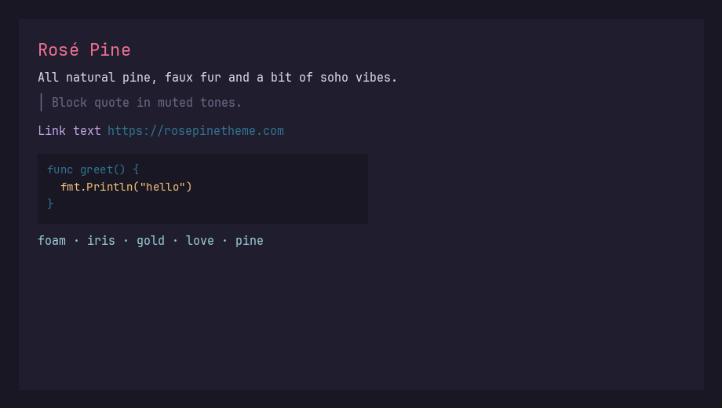
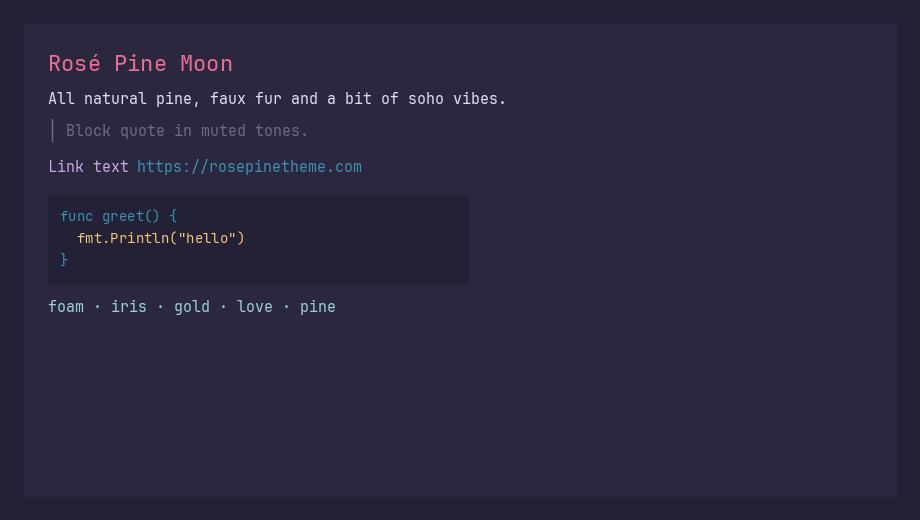
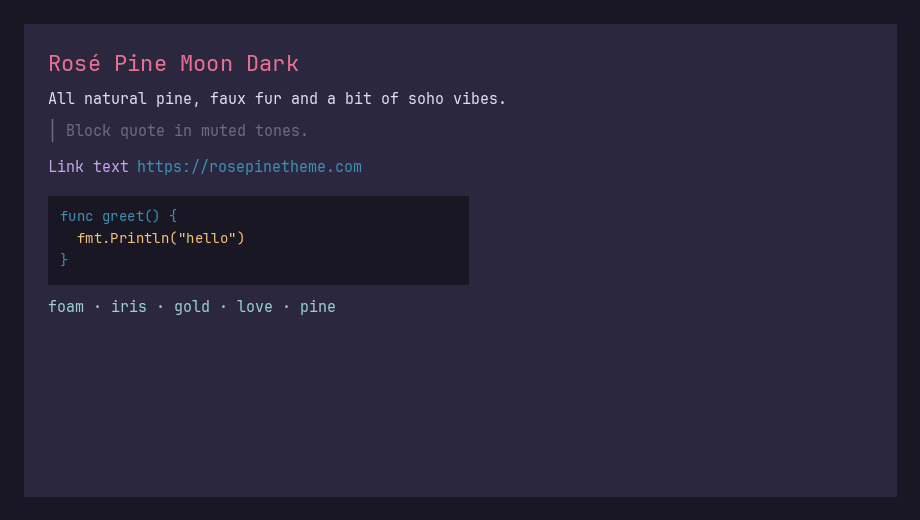
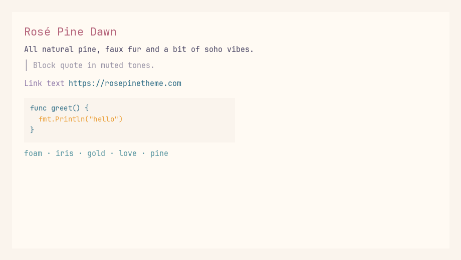

<p align="center">
    
    <h2 align="center">Rosé Pine for Glow</h2>
</p>

<p align="center">All natural pine, faux fur and a bit of soho vibes for the classy minimalist</p>

<p align="center">
    <a href="https://github.com/rose-pine/rose-pine-theme">
        
    </a>
</p>

Glamour styles for [**Glow**](https://github.com/charmbracelet/glow), the terminal markdown reader from Charm. Colors follow the official [**Rosé Pine**](https://rosepinetheme.com/) palette (main, moon, moon dark, and dawn), with syntax roles aligned to [rose-pine-bat](https://github.com/drluckyspin/rose-pine-bat).

See **[palette comparison](docs/palette-comparison.html)** for a visual guide to how the variants differ.

## Usage

1. Install [Glow](https://github.com/charmbracelet/glow#installation) (for example: `brew install glow` on macOS).

2. Clone this repository and run the installer:

   ```bash
   make install
   ```

   The interactive installer will:

   - Copy all four style JSON files to `~/.config/glow/styles/` (or a path you choose)
   - Ask which variant to use as your default (default: **rose-pine-moon-dark**)
   - Set word-wrap width and whether to disable the pager in `glow.yml`
   - Back up an existing config to `glow.yml.bak` before writing changes

   On macOS, `glow.yml` is usually under `~/Library/Preferences/glow/` or `~/Library/Application Support/glow/`. The installer auto-detects an existing file.

   **Non-interactive** (CI or scripting):

   ```bash
   make install INSTALL_FLAGS="--yes" INSTALL_STYLE=rose-pine-moon-dark
   ```

   Or run the script directly:

   ```bash
   ./scripts/install.bash --yes --style rose-pine-moon-dark
   ```

   | Flag / variable | Purpose |
   | ----------------- | ------- |
   | `--yes` / `INSTALL_FLAGS="--yes"` | Accept defaults (styles dir, moon-dark, width 80, pager off, update config) |
   | `--style NAME` / `INSTALL_STYLE` | Default variant (`rose-pine`, `rose-pine-moon`, `rose-pine-moon-dark`, `rose-pine-dawn`) |
   | `--styles-dir PATH` / `GLOW_STYLES_DIR` | Where to copy JSON styles |
   | `--config PATH` / `GLOW_CONFIG_FILE` | Path to `glow.yml` |
   | `make install` | Runs `make build` first if styles are missing |

3. Browse markdown with `glow` (TUI) or `glow README.md`. For a one-off style:

   ```bash
   glow -s ~/.config/glow/styles/rose-pine-dawn.json README.md
   ```

   See [`glow.example.yml`](glow.example.yml) for a minimal config snippet you can merge into `glow.yml`.

### Scripting

When piping or redirecting output (`glow doc.md | head`, `> file.txt`), add `--pager=false` if your config has `pager: true`. In non-interactive use, pass `-s` explicitly so Glow does not fall back to the plain `notty` style.

## Variants

| File | Description |
| ---- | ----------- |
| [`styles/rose-pine.json`](styles/rose-pine.json) | Rosé Pine (main, dark) |
| [`styles/rose-pine-moon.json`](styles/rose-pine-moon.json) | Rosé Pine Moon (official moon base) |
| [`styles/rose-pine-moon-dark.json`](styles/rose-pine-moon-dark.json) | Moon accents on main base — pairs with [rose-pine-bat](https://github.com/drluckyspin/rose-pine-bat) |
| [`styles/rose-pine-dawn.json`](styles/rose-pine-dawn.json) | Rosé Pine Dawn (light) |

## Gallery

### Rosé Pine



### Rosé Pine Moon



### Rosé Pine Moon Dark



### Rosé Pine Dawn



## Developing

Requires `jq`, `python3`, and `go` (`brew install jq python go`). Optional: `glow` for `make preview`, Pillow for `make screenshots` (`pip install pillow`).

```bash
make help       # list targets (Rosé Pine–themed output)
make check      # verify tools
make build      # regenerate styles/*.json from scripts/build-styles.py
make test       # validate JSON + Glamour render (scripts/verify)
make install    # copy styles + configure glow.yml
make screenshots   # regenerate gallery PNGs
make preview STYLE=rose-pine-moon-dark   # preview examples/sample.md
make clean      # remove Python caches and Go test cache
```

Styles are generated from palette definitions in `scripts/build-styles.py`; edit that file (or the palettes inside it) rather than hand-editing JSON when changing colors.

## Thanks to

- [charmbracelet/glow](https://github.com/charmbracelet/glow) for Glow
- [charmbracelet/glamour](https://github.com/charmbracelet/glamour) for terminal markdown styling
- [Rosé Pine](https://github.com/rose-pine) for the palette
- [drluckyspin/rose-pine-bat](https://github.com/drluckyspin/rose-pine-bat) for syntax color mapping inspiration

## Contributing

Issues and pull requests are welcome. For palette changes, stay aligned with the [official Rosé Pine palette](https://github.com/rose-pine/palette) unless you are documenting an intentional fork.
